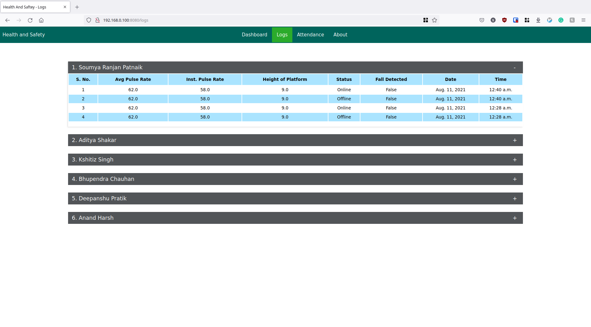
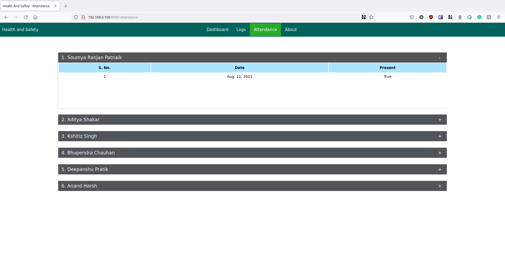

# Health-And-Safety-Dashboard

This code present in this repository acts as the **frontend** and **webserver** for the project **IoT BasedHealth and Safety For Construction Workers**. 

**NOTE 1**: Find the code for the sensor node [here](https://github.com/SoumyaRanjanPatnaik/iCAP-Node.git) 

**NOTE 2**: For more information, please refer to the Research paper - https://doi.org/10.1109/I2CT54291.2022.9825406
# Overview
***IoT Based Health and Safety for Construction workers*** is comprised of two parts: **Sensor Nodes** and **WebServer**.

## Sensor Nodes

**NOTE**: If this sectiion contains a workaround for latex might not  be readable in dark mode. You can either switch to light mode or view a pre-rendered image [here](./assets/img/LaTeX.png).

The workers will be required to wear sensor nodes that exist in the form of helmets, which will be used to monitor the vitals of the workers (Temparature and Pulse) and to detetect falls. Since the **accelerometer** is responsible for detecting falls, the chances of false positives is high. This is because the acceleration a fall is  regardless of the height of the platform the worker was standing on. We hence use a barometer to calculate the height of the platform above round level, after which we calculate the expected duration of fall using kinematics.

Let the height of the platform be [formula](https://render.githubusercontent.com/render/math?math=H), acceleration due to gravity be  and the expected duration of fall be . We can assume the initial velocity to be . 

For equations of motion, we get

Since , we can rewrite the above expression as

We can hence conclude that a fall has occurred if the duration of fall detected using the accelerometer (say ) is greater than the expression of expected duration of fall (say ) obtained above after correcting for margin of error (say E), i.e.,

All the data is sent to both **ThingSpeak** and a local **Django WebServer**. 

**Note**: All workers need to be assigned a single helmet.

## WebServer
***Note*: This is not the same as ESP8266 Web Server.**

The Django WebServer is used to send recieve, process and store the data recieved from the sensor nodes, and to display it on any device present on the same network as the webserver. 

The webserver is explained in more detail in the upcoming sections of this README.

# Features
## Backend
1. **Recieve Data From Sensor Nodes**: The sensor nodes can send relavant data to the webserver using the route **/send**. 
1. **SQLite Database**:  All data recievend from the sensor nodes is stored within a SQLite Database.
1. **Automatic Attendance**: This automaically marks the attendance of the worker if he or she is wearing the helmet.
1. **Instantaneously update the frontend**: The front-end gets dynamically updated instantaneously, as soon as the data is recieved from the sensor nodes.
## Frontend
1. **Interactive and informative dashboard**: A beautiful dashboard that dynamically updates by fetching data from the django server using get request.
1. **Logs**: The logs can be viewed in this page for each worker.
1. **Attendance**: This section can be used to mark the attendance of the wrokers based on weather their helmet was on during any paticular day. 

# Details of DataBase:  
There are 3 django models (or sql table) in the database.
* **Worker**: This model stores the details of the workers. It has the following fields:
	* **worker_id**: This is the Primary Key of the model. Each helmet (sensor node) is assigned a unique worker_id.
	* **name**: This stores the name of worker wearing the helmet
	* **location_of_work**: This is loaction that has been assigned to the worker.
* **Log**: This model logs the data sent by the sensor node of worker. It has the following fields:
	* **worker_id**: This is the foriegn key to the model *Worker*. 
	* **height**: This field stores the height of the platform where on which the worker was working, when the data was logged.
	* **avg_bpm**: This field stores the average bpm (pulse rate) when the data was logged
	* **curr_bpm**: This field stores the instantaneous bpm (pulse rate) when the data was logged
	* **temparature**: This field stores the instantaneous body temparature when the data was logged
	* **fall**: This field stores a boolean value representing weather a fall was detected while logging the data.
	* **time**: This field stores the time of logging.
	* **date**: This field stores the date of logging.
	* **datetime**: This field stores the datetime while logging. This filed is used to mark attendence of any given worker.
* **Attendance**: This model stores the attendance of all workers. It has the following fields:
	* **worker_id**: This is the foriegn key to the model *Worker*. 
	* **date**: This field stores the date of attendance.
	* **Present**: This field stores weather the worker was present on any given day.
	
# Gallery

# Video Demo

https://user-images.githubusercontent.com/75623505/129031345-91c051a8-6423-404e-aebd-79fafc734a77.mp4
